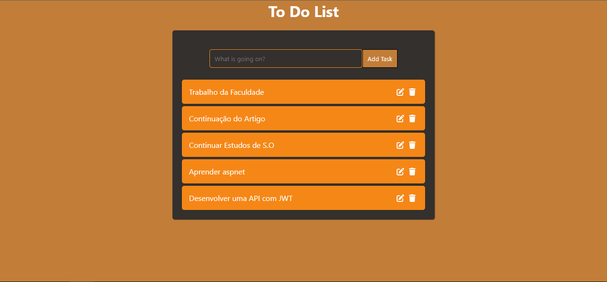
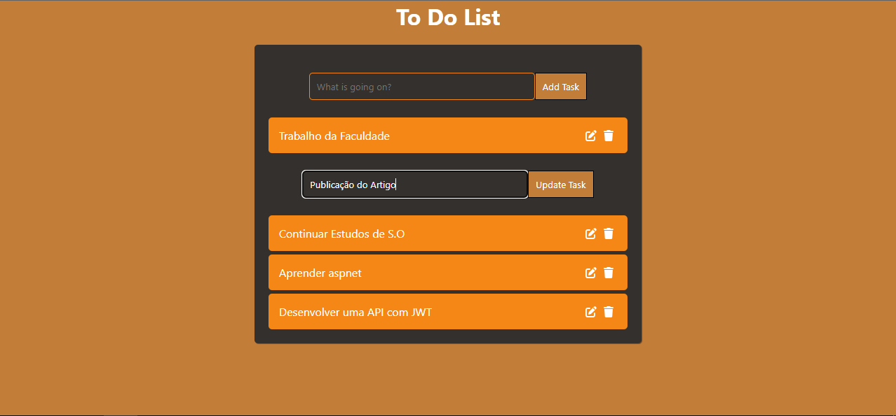

# to-do-list
 A to-do list application, in React and Flask.

**Description**

 To Do List project, in which there is a CRUD with tasks and you can mark them as completed or not. You go to the application, write down your tasks that you don't want to forget, and maybe take a look at the previous ones.

 NOTE: It is not an ideal web application project, since the backend is designed in a way to store all tasks together, so all clients who would enter the site would have their tasks shared with everyone. The purpose of this project is just to practice.

**Installation instructions**

**System requirements**

* Python 3.10
* Node.js 20.10
* NPM 10.2

**Frontend application installation**

1. Enter the frontend application folder
2. Run `npm install` to install dependencies
3. Run `npm run dev` to launch the application in development mode

**API installation**

1. Enter the backend application folder
2. Run `pip install -r requirements` command to install dependencies
3. Run `flask --app api db init` to start migrations, `flask --app api db migrate` to run migrations and `flask --app api db upgrade` to apply migrations to the database
4. Run `flask --app api run` to run development mode

**Docker Compose**

If you have Docker installed, you can also run the project using Docker Compose.

1. Navigate to the project directory where the `docker-compose.yml` file is located

2. Run `docker-compose up --build` command to build and start the containers

**Screenshots**

A list of 5 tasks.

Editing a task.

